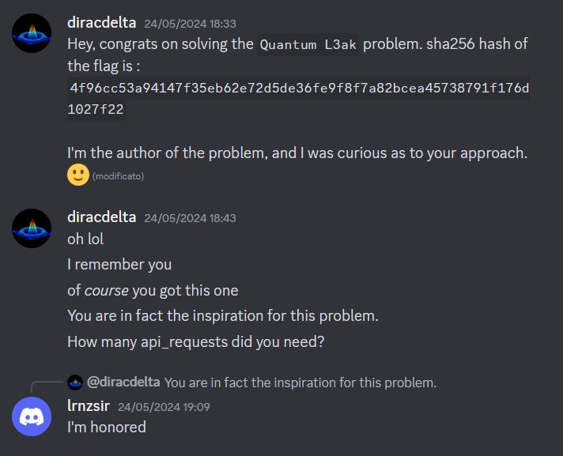

# Quantum L3ak (1 solve) :drop_of_blood:

## Description

The challenge's main objective is to **leak the state of Python's random number generator** by performing a series of measurements on a quantum circuit so that we can predict the key used to encrypt the flag at the end of the session.

## Preliminaries

At the start of each session, the server:

- initializes a `Random` object with a seed taken from `os.urandom` and stores it in the variable `rng`;
- generates an unknown random `noise_circuit` of 8 qubits that contains only `H` and `CX` gates (Hadamard and CNOT gates);
- set-ups the API with `rng`.

By interacting with the API, with a maximum of 3200 times, we can do the following operations:

- **upload** a quantum circuit of 8 qubits to the server as `uploaded_circuit` that contains only `H` and `CX` gates;
- **display** our uploaded quantum circuit;
- **measure** the quantum circuit obtained by composing `noise_circuit` and `uploaded_circuit`, with the result obtained by using `rng` as a source of randomness;
- **exit** the session.

When we exit the session, the server will generate a random key of 16 bytes using `rng` and encrypt the flag with it using AES.

### Measurement

The function `perform_measurement` is the heart of the challenge since it is the operation that uses `rng`. It composes the `noise_circuit` and the `uploaded_circuit`, runs the circuit on a `StatevectorSimulator` and gains the probabilities of each state. Then, it sorts the states by their values as 8 bits and returns a random state based on the probabilities using `rng.choices`. Here's the actual implementation:

```python
def perform_measurement(rng : Random, statesim : StatevectorSimulator):
    circuit = QuantumCircuit(8)
    noise = noise_circuit.copy()
    circuit = circuit.compose(noise)
    if uploaded_circuit is not None:
        circuit = circuit.compose(uploaded_circuit)
    result = statesim.run(circuit).result()
    statevector : Statevector = result.get_statevector()
    probs_dict = statevector.probabilities_dict()
    states = []
    probs = []
    state_count = len(probs_dict)
    for state in sorted(probs_dict.keys()):
        states.append(state)
        probs.append(round(probs_dict[state]*state_count))
    print(rng.choices(states, weights=probs)[0])
```

If we do not upload any quantum circuit, the server will measure the `noise_circuit` and return the result. Due to the structure of the `noise_circuit` generated by `generate_noise`, only $2^4 = 16$ states are possible, and the probabilities of each state are equal. As we'll see later, having only $16$ possible states is not enough to leak the full state of the random number generator with the number of measurements we can perform.

By using some queries, we could recover the `noise_circuit` and untangle it using our `uploaded_circuit` to get $2^8 = 256$ possible states with equal probabilities. However, this is not needed as we can untangle the `noise_circuit` using a random `uploaded_circuit` generated with `noise_circuit`, with probability $1 / 4$, and get $2^8 = 256$ possible states with equal probabilities at each query.

### `random.choices` implementation

Since the only leak we have to the random number generator is the output of `rng.choices`, we need to understand how it works to exploit it. The `random.choices` function is implemented as follows (in Python 3.10):

```python
def choices(self, population, weights=None, *, cum_weights=None, k=1):
    """Return a k sized list of population elements chosen with replacement.

    If the relative weights or cumulative weights are not specified,
    the selections are made with equal probability.

    """
    random = self.random
    n = len(population)
    if cum_weights is None:
        if weights is None:
            floor = _floor
            n += 0.0    # convert to float for a small speed improvement
            return [population[floor(random() * n)] for i in _repeat(None, k)]
        try:
            cum_weights = list(_accumulate(weights))
        except TypeError:
            if not isinstance(weights, int):
                raise
            k = weights
            raise TypeError(
                f'The number of choices must be a keyword argument: {k=}'
            ) from None
    elif weights is not None:
        raise TypeError('Cannot specify both weights and cumulative weights')
    if len(cum_weights) != n:
        raise ValueError('The number of weights does not match the population')
    total = cum_weights[-1] + 0.0   # convert to float
    if total <= 0.0:
        raise ValueError('Total of weights must be greater than zero')
    if not _isfinite(total):
        raise ValueError('Total of weights must be finite')
    bisect = _bisect
    hi = n - 1
    return [population[bisect(cum_weights, random() * total, 0, hi)]
            for i in _repeat(None, k)]
```

We immediately notice that it uses `self.random`, i.e. `random.random`, to choose the elements from `population` using a distribution defined by `weights` or `cum_weights`. Recalling the function `perform_measurement` we can suppose that `population` contains all the possible states of 8 bits and `weights` contains the probabilities of each state, which are all equal.

With these informations, we know that the output of `rng.choices` will correspond to the following code:

```python
def choices(self, population, weights=None, *, cum_weights=None, k=1):
    # ...
    return [population[int(random() * n)] for i in _repeat(None, k)]
```

### Python random number generator

The Python random module uses the **Mersenne Twister algorithm**, which is a pseudorandom number generator that performs only bit operations. The state of the generator is a 624-element array of 32-bit integers, and the generator produces 32-bit integers as output.

The following function `genrand_uint32` is the implementation of the Mersenne Twister algorithm in C from the [random module source code](https://github.com/python/cpython/blob/main/Modules/_randommodule.c):

```c
/* Period parameters -- These are all magic.  Don't change. */
#define N 624
#define M 397
#define MATRIX_A 0x9908b0dfU    /* constant vector a */
#define UPPER_MASK 0x80000000U  /* most significant w-r bits */
#define LOWER_MASK 0x7fffffffU  /* least significant r bits */

// other definitions

/* generates a random number on [0,0xffffffff]-interval */
static uint32_t
genrand_uint32(RandomObject *self)
{
    uint32_t y;
    static const uint32_t mag01[2] = {0x0U, MATRIX_A};
    /* mag01[x] = x * MATRIX_A  for x=0,1 */
    uint32_t *mt;

    mt = self->state;
    if (self->index >= N) { /* generate N words at one time */
        int kk;

        for (kk=0;kk<N-M;kk++) {
            y = (mt[kk]&UPPER_MASK)|(mt[kk+1]&LOWER_MASK);
            mt[kk] = mt[kk+M] ^ (y >> 1) ^ mag01[y & 0x1U];
        }
        for (;kk<N-1;kk++) {
            y = (mt[kk]&UPPER_MASK)|(mt[kk+1]&LOWER_MASK);
            mt[kk] = mt[kk+(M-N)] ^ (y >> 1) ^ mag01[y & 0x1U];
        }
        y = (mt[N-1]&UPPER_MASK)|(mt[0]&LOWER_MASK);
        mt[N-1] = mt[M-1] ^ (y >> 1) ^ mag01[y & 0x1U];

        self->index = 0;
    }

    y = mt[self->index++];
    y ^= (y >> 11);
    y ^= (y << 7) & 0x9d2c5680U;
    y ^= (y << 15) & 0xefc60000U;
    y ^= (y >> 18);
    return y;
}
```

The function `genrand_uint32` is then used in the C implementations of `random.random` and `random.getrandbits` to generate random numbers. Here's the implementation of `random.random`:

```c
static PyObject *
_random_Random_random_impl(RandomObject *self)
/*[clinic end generated code: output=117ff99ee53d755c input=26492e52d26e8b7b]*/
{
    uint32_t a=genrand_uint32(self)>>5, b=genrand_uint32(self)>>6;
    return PyFloat_FromDouble((a*67108864.0+b)*(1.0/9007199254740992.0));
}
```

As we can see, the most significant bits of the output of `random.random` are mainly based on the value of `a`. We know that we would get `int(random() * n)` from `rng.choices` outputs, thus we can **recover the 8 most significant bits** of `a` since `n = 256`.

## Solution

Since Mersenne Twister performs only bit operations such as XOR, AND (only with constants), and bit shifts, and works with 32-bit integers, we can compute a system of linear equations to recover the state of the random number generator.

Let $\mathbb{F}_2$ be the field with two elements and let $n = 32$ and $N = 624$. We can represent any operation on a 32-bit integer with the respective operations on $\mathbb{F}_2^n$:

- XOR is represented by addition in $\mathbb{F}_2^n$.
- AND with a constant is represented by multiplication entry-wise in $\mathbb{F}_2^n$.
- Bit shifts are represented by shifts in the vector entries without wrapping around.

Since the state of the random number generator is a 624-element array of 32-bit integers, we can represent it with $N \times n$ variables in $\mathbb{F}_2$.

We implement the symbolic Mersenne Twister with the class `MersenneTwisterSymbolic` in the file [mersenne_crack.py](./mersenne_crack.py). We use SageMath `BooleanPolynomialRing` to represent the variables and `vector` to represent one 32-bit integer of the state. We then implement the `twist` and `genrand_int32` methods to perform the operations of the Mersenne Twister algorithm. We choose to use `BooleanPolynomialRing` instead of `PolynomialRing` because it's faster since it is optimized for boolean polynomials.

To recover the full state of the random number generator, we need at least $N \times n = 624 \times 32 = 19968$ equations, which do not depend on each other (or close enough so that we can recover the encryption key). We can see that by not uploading any quantum circuit, we would only get $\log_2(16) \times 3200 = 12800$ equations, which are not enough to recover the full state. Instead, by uploading a quantum circuit generated with `generate_noise`, with probability $1 / 4$, we get $\log_2(256) \times 3200 = 25600$ equations, which should be enough to recover the full state.

To generate the system of equations, test it and recover the random number generator state from it, we implement the functions `gen_system`, `test_system` and `get_random_from_outs` respectively, in the file [mersenne_crack.py](./mersenne_crack.py). We generate the coefficient matrix of the system by choosing deliberately to use a dense `Matrix` since SageMath offers a neat way to save and load dense matrices in $\mathbb{F}_2$ to and from PNG files.

On a last note, to know if we are in the $1 / 4$ probability case, we can check if the set of the first 256 outputs of `rng.choices` contains more than 128 unique elements. If it does, we can be sure that we are in the correct case and we can proceed to recover the state of the random number generator, otherwise, we can close the session and start a new one.

The following script implements the solution ([solve.py](./solve.py)):

```python
from mersenne_crack import gen_system, test_system, get_random_from_outs, MersenneTwister
from pwn import remote, process, context
from Crypto.Cipher import AES
from enum import Enum
import random, json, re, os

nleaks = 8
nqueries = 3198
assert nqueries < 3200
assert nqueries * nleaks >= MersenneTwister.N * 32
if not os.path.exists(f"matrix-{nqueries}-{nleaks}.png"):
    gen_system(nqueries, nleaks)

API_CHOICE = Enum("API_CHOICE", ["UploadCircuit", "DisplayCircuit", "PerformMeasurement", "Exit"])


def generate_noise_json() -> dict:
    circuit = {"gates": []}
    controls = random.sample(range(8), k = 4)
    dependents = set(range(8)) - set(controls)
    for c in controls:
        circuit["gates"].append(f"H {c}")
        coupled = random.sample(list(dependents), k=1)
        dependents -= set(coupled)
        for cx in coupled:
            circuit["gates"].append(f"CX {c} {cx}")
    return circuit


def query_mesurement(nqueries: int, timeout=0.01) -> list[int]:
    global io, API_CHOICE
    io.send(f"{API_CHOICE.PerformMeasurement.value}\n".encode() * nqueries)
    data = io.recvrepeat(timeout)
    while len(re.findall(r"[01]{8}".encode(), data)) < nqueries:
        data += io.recvrepeat(timeout)
    return [int(x, 2) for x in re.findall(r"[01]{8}".encode(), data)]


while True:
    uploaded_circuit = generate_noise_json()

    context.log_level = "info"
    # io = process(["python3", "quantum.py"])
    io = remote("193.148.168.30", 5666)

    io.sendlineafter(b"Choice: ", str(API_CHOICE.UploadCircuit.value).encode())
    io.sendlineafter(b"Enter circuit json:", json.dumps(uploaded_circuit).encode())

    outs = query_mesurement(256)
    if len(set(outs)) > 128:
        break
    io.close()

outs.extend(query_mesurement(nqueries - 256))

io.sendline(str(API_CHOICE.Exit.value).encode())
io.recvline_contains(b"Flag:")
ct = bytes.fromhex(io.recvline_contains(b"ct:").split(b" ").pop().decode())
iv = bytes.fromhex(io.recvline_contains(b"iv:").split(b" ").pop().decode())

rng = get_random_from_outs(nqueries, nleaks, outs, verbose=True)

key = sum(rng.genrand_int32() << (32 * i) for i in range(4)).to_bytes(16, "little")
iv_ = sum(rng.genrand_int32() << (32 * i) for i in range(4)).to_bytes(16, "little")
assert iv == iv_

pt = AES.new(key, mode=AES.MODE_CBC, iv=iv).decrypt(ct)
print(pt)
```

> **Flag**: `L3AK{m4x1m1z3_3ntr0py}`

## Challenge *Lore*

At the start of the CTF, I took a rapid look at the challenges, and when I saw this one I thought it was similar to the challenge [B4 the B8](https://www.overleaf.com/read/fnjzhyxzmspq#096557) from the [UMassCTF 2024](https://ctftime.org/event/2287) I had solved the uninteded way.

In that challenge, the quantum protocol had a vulnerability, but also there was an unintended vulnerability since it used Python's random number generator instead of a secure one. Initially, I thought that this challenge was similar, and the author forgot to use a secure random number generator, but the challenge itself required leaking the state of the random number generator, thus this time my solution was intended.

After understanding the quantum part of the challenge, I modified the script I used to solve B4 the B8 to solve this challenge and secured the first blood and the only solve of the challenge during the CTF. Shortly after, the author of the challenge contacted me on Discord:


